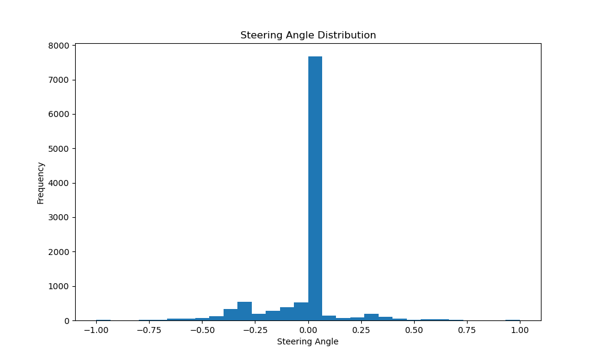
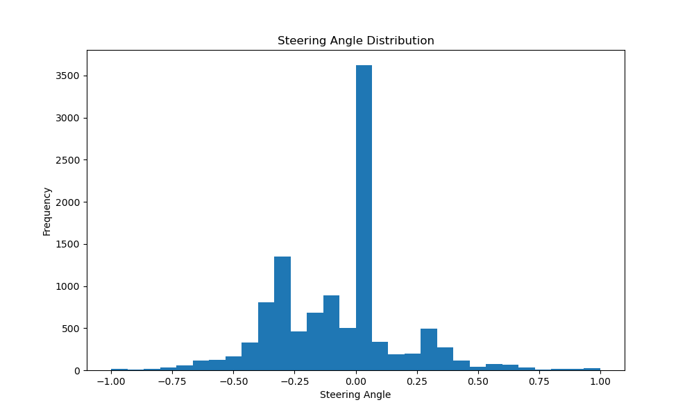
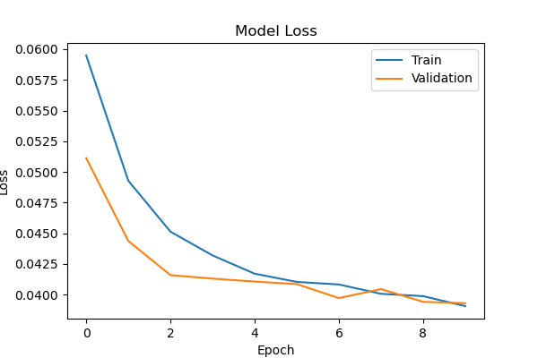

## Demo Video

Watch the simulation:
[**Self-Driving Car Simulation Video**](https://drive.google.com/file/d/1aoU14itfc-nT7xGAAOn5hT1vciHzjgiT/view?usp=sharing)

*Note: The video uses the `modelv16.h5` model which is also the final submission  model for this project.*

## Data Analysis & Model Performance

### Steering Angle Distribution

The project includes data preprocessing to balance the steering angle distribution, reducing bias towards straight driving:

**Before Preprocessing:**


**After Preprocessing:**


### Model Training Results

Model loss curve



The `modelv16.h5` model achieved stable training with good convergence, as demonstrated in the loss curve above.

## Setup Environment

1. **Clone the repository**
   ```bash
   git clone https://github.com/PrEEtPatEl44/CarSimProject.git
   cd CarSimProject
   ```

2. **Create conda environment**
   ```bash
   conda create --name car-sim --file package_list.txt
   conda activate car-sim
   ```


